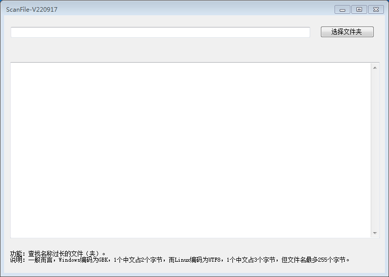

# scanFile
Find the file can't copy to linux from windows. 【仅在windows平台运行】

功能：查找名称过长的文件（夹）。说明：一般而言，Windows编码为GBK，1个中文占2个字节，而Linux编码为UTF8，1个中文占3个字节，但文件名最多255个字节。

## Licence
MIT License - see LICENSE for more details
